# Overview
Simple notes application using SQLite database

# Description

App allows to do basic operations with notes: create, update, delete and search

## Create note

To create note follow these steps:

1. Press "+" button on main screen
   
   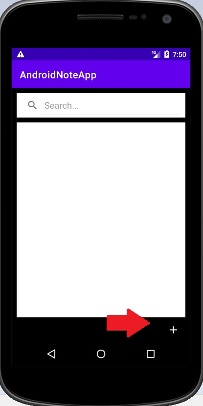
   
2. Enter text in input field
   
   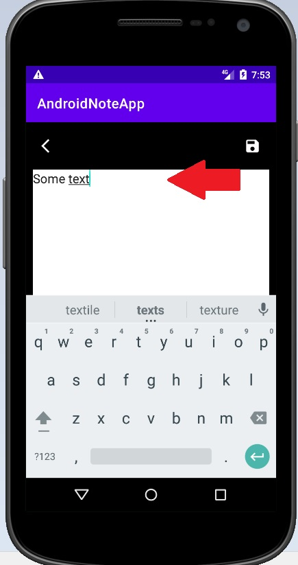
   
3. Press save button
   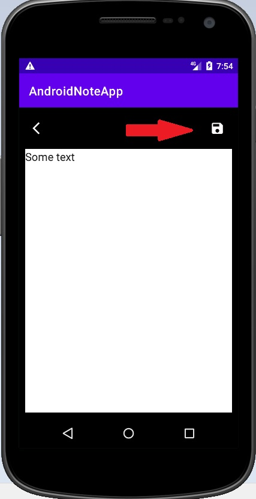
   
4. Done! Note is saved
   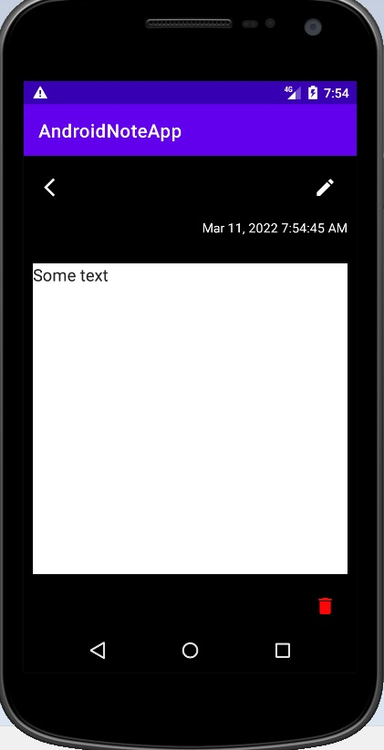
   
5. Before save press back button to cancel creation and get back to main screen
   
   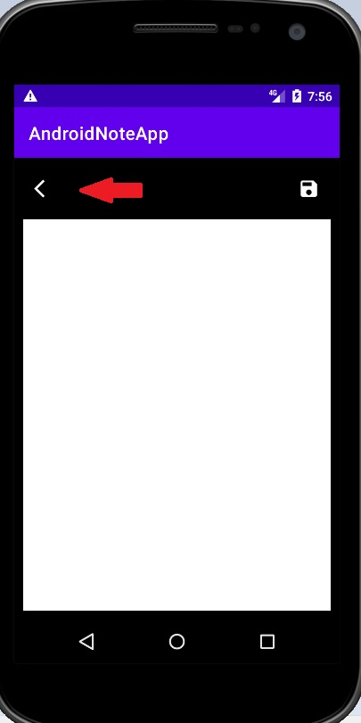
   
## Edit note

To edit note follow these steps:

1. Click on note you want to see
   
   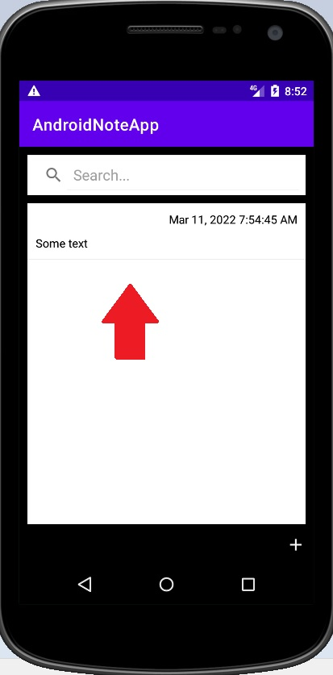
   
2. Change text in input field
   
   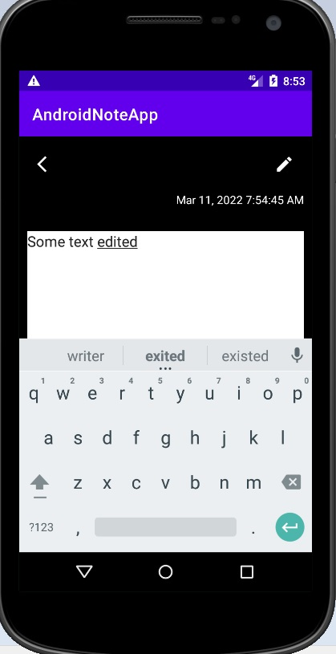
   
3. Click on save button
   
   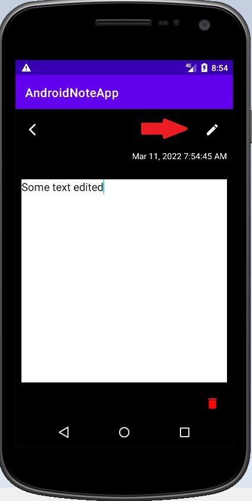
   
4. Done! Note is edited
   
   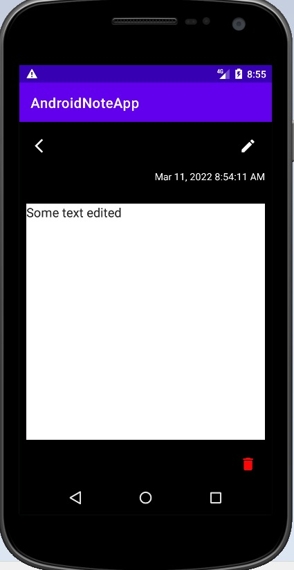
   
## Delete note

To delete note follow these steps:

1. Click on note you want to delete
   
   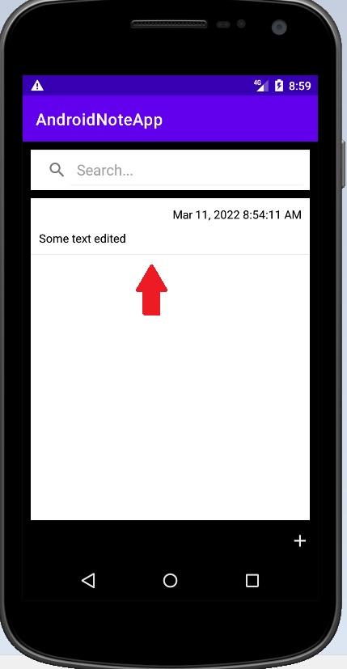
   
2. Click on delete button
   
   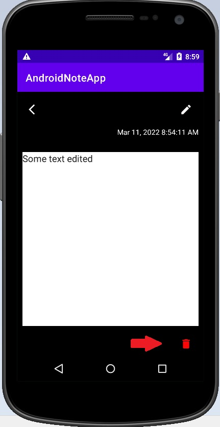
   
3. Done! Note is deleted
   
   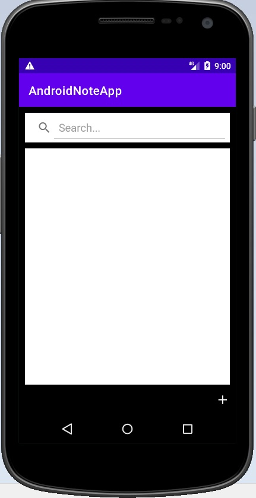

## Search note

To search through note list follow these steps:

1. Enter desired note's content in a search field. Let it be note with content "fifth"
   
   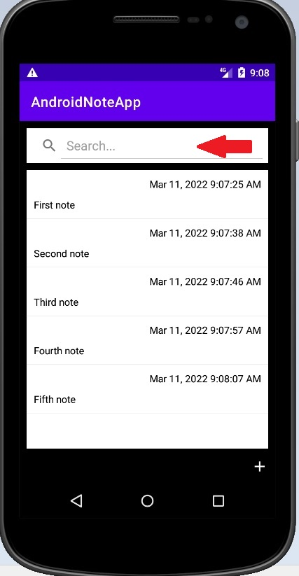
   
2. Have a look on search result
   
   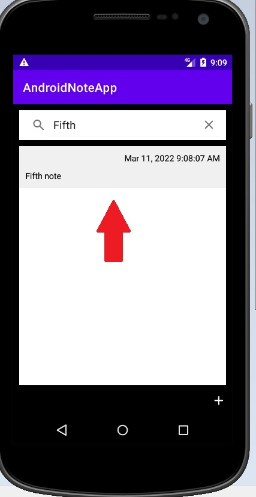